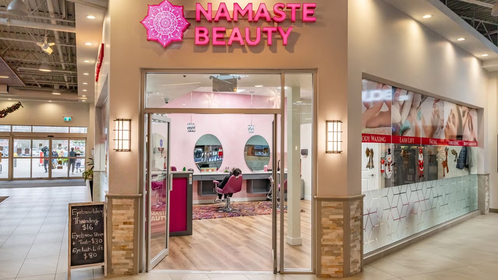

# Namaste Beauty

A modern beauty salon website built with Next.js and Prismic CMS that allows customers to explore and book beauty services.

## Features

- Responsive design optimized for all devices
- Interactive service booking system
- Dynamic content management through Prismic CMS
- Beautiful parallax effects and animations
- Service catalog with detailed descriptions
- Easy appointment scheduling
- Contact form integration

## Tech Stack

- **Frontend Framework**: Next.js 14
- **CMS**: Prismic.io
- **Styling**: Tailwind CSS
- **Animations**: Custom React hooks, GSAP
- **Deployment**: Vercel

## Media Credits

- Video by cottonbro studio: https://www.pexels.com/video/dancer-through-a-translucent-covering-6541892/

